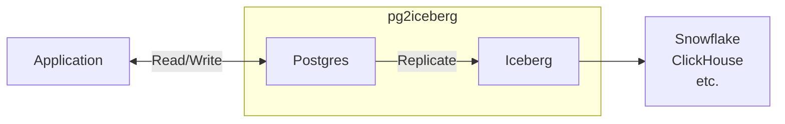

# pg2iceberg

pg2iceberg replicates data from Postgres directly to Iceberg.

## FAQ

### Will it support other sources and sinks in the future?

No. As its name suggests, it's specifically designed to replicate data from Postgres to Iceberg.
